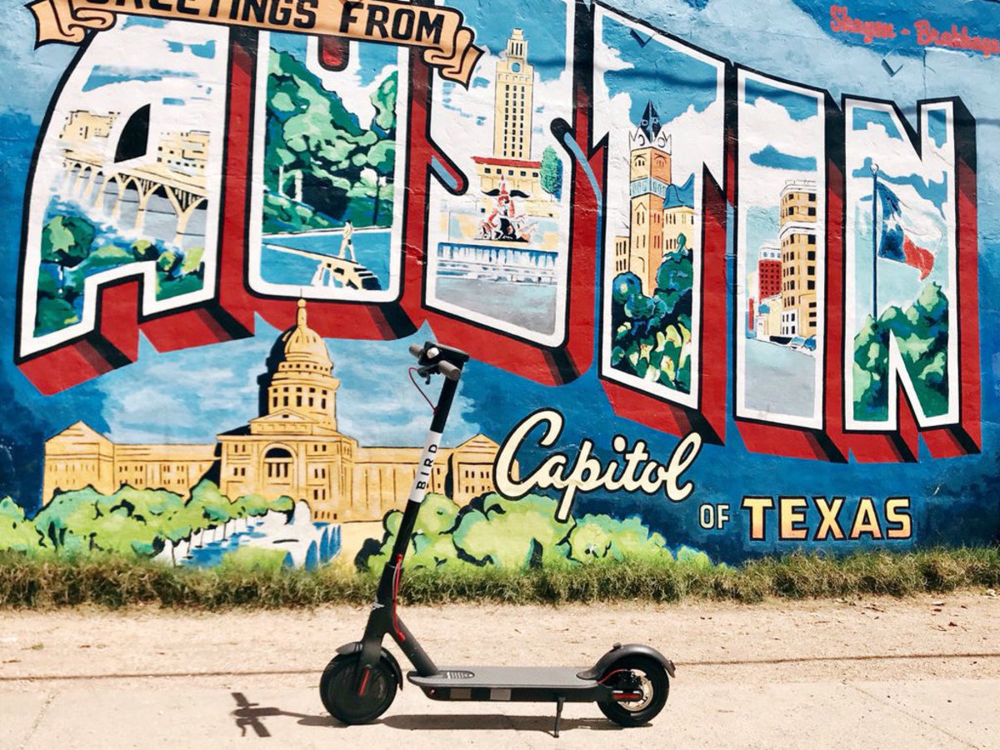
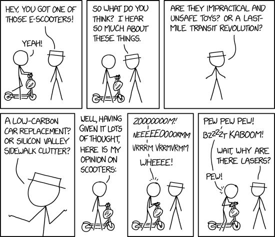

##  Scooters in Austin Data Analysis | JSON-and-team 
### Team Members: Erin Bentley, Jason Jones, Sana Khan, Sheetal Bongale
#### UT Data Analysis & Visualization Bootcamp | Python Project 1 | January 2020
---

#### *`"In 2018, people took 84 million trips on Shared Micromobility in the United States, more than double the number of trips taken in 2017." - NACTO`*

### Project Requirements:
---
- Two to three plots (and think about getting information visualized onto fewer plots). NO PIE CHARTS
- Greater than or equal to two datasets
- At least one dataset comes from merging different tables/sources (deliverable)
- At least 1 dirty dataset (not Kaggle)
- At least one API used
- Export dataframe to SQL Database (explained 1/4/2020)
- 10 minute presentation
- Use Jupyter Lab to present...no PPT.
---

### Our Question:
---
- Do the most popular zip codes to start or end rides also have the most complaints?
- Does frequency of ending scooter rides in zipcode impact complaints when adjusted on per capita basis?
- Number of rides in certain months of the year.
- Does the distance of the trip impact the method of transportation (scooter vs. bicycle)
- What are the 10 most frequent routes for all methods?

### Hypothesis:
---
While we thought that obviously the neighborhoods with the most rides would likely have the most complaints, we also thought that some neighborhoods complain about a higher percent of the scooters that enter their area than other neighborhoods do.
We figured these would be neighborhoods that are not as popular start points, who see the scooters longer and thus are more likely to complain.

### Data Set:
---
* City of Austin 311 OpenData: https://data.austintexas.gov/City-Government/311-Unified-Data-Test-Site-2019/i26j-ai4z
    - API Endpoint: https://data.austintexas.gov/resource/i26j-ai4z.json
    
* Austin Shared Mobility API: https://data.austintexas.gov/Transportation-and-Mobility/Shared-Micromobility-Vehicle-Trips/7d8e-dm7r
    - API Endpoint: https://data.austintexas.gov/resource/7d8e-dm7r.json
    
* Census tract to zipcode conversion: https://www.huduser.gov/portal/datasets/usps_crosswalk.html

### Actions and Tasks:
---
- Data Extraction
- Data Cleaning and Exploration
- Data Story and Visualization
- Writing Analysis and Conclusions

### Notebooks:
---
- [shared_mobility_data_wrangling.ipynb](https://github.com/sheetalbongale/Scooters_In_Austin_Data_Analysis/blob/master/notebooks/shared_mobility_data_analysis/shared_mobility_data_wrangling.ipynb): Data munging and generates clean data CSV file for the Shared Mobility API Data. Also contains script to merge zipcodes to census tracts. The final merged CSV file is what we use for further analysis and visualization.
- [shared_mobility_data_story.ipynb](https://github.com/sheetalbongale/Scooters_In_Austin_Data_Analysis/blob/master/notebooks/shared_mobility_data_analysis/shared_mobility_data_story.ipynb): Data Visualization for shared mobility and some incomplete further work.
- [311_data_wrangling.ipynb](https://github.com/sheetalbongale/Scooters_In_Austin_Data_Analysis/blob/master/notebooks/311_complaints_data_analysis/311_data_wrangling.ipynb): Data munging and generates clean data CSV file for the 311 Complaints API Data. 
- [311_data_story.ipynb](https://github.com/sheetalbongale/Scooters_In_Austin_Data_Analysis/blob/master/notebooks/311_complaints_data_analysis/311_data_story.ipynb): Data Visualization for 311 data.
- *write_to_sql.py:* Convert the 311 dataframe to SQL Database.

### Conclusions:
---

**Observations:**
1. 78701 Zipcode has the most number of starting and ending rides.
2. 78701 also had the most 311 complaints about shared mobility and dockless vehicles.
3. Saturday was the most popular day to ride a bicycle or a scooter. Also, Weekend spike indicates people like to ride scooters recreationally, or while they are enjoying activities that are outside of their normal weekly commute.
4. We can see there is a rush hour after work. We saw a peak in the number of rides at 5pm and also before & after 5pm. 
5. October, September and March have the most rides. This is when the weather is nicest in Austin, but also when the biggest Music festivals are. 

**Major limitations in our data:**
1. The data set for the shared mobility data is limited by geography, we can’t get more specific than census tract. Hence we used Census tract shapefiles and geopandas.
2. 311 data was not clear about what the complaints were specifically about — you would have to manually find them on the 311. We also couldn’t see if it was business, resident, or passerby.
3. Joyriding, some rides are really short— some people just turn scooters on and don’t seem to take it anywhere. Our overall hypothesis and the census tract choropeth plots will change if we discard all the rows for rides with '0'meter distance.
4. We’d like to isolate the music festival dates out and see how much those specific dates impact the data.
5. 78701: Neighborhoods that are mostly commercial have a lot of people who work there, own businesses there, walk around there, but do not show up in the population. It is possible that business owners are more likely to complain because they are made less available to customers due to scooter issues. Nearly 100k people work in downtown Austin which is drastically different from the number of people who are living there. We saw rush hour right after work.

### Technologies Used:
---
- Pandas 
- NumPy
- Matplotlib 
- GeoPandas
- Plotly.py
- SQLAlchemy

### Resources Used:
---
- Census Tracts Shapefiles: https://www2.census.gov/geo/tiger/TIGER2010/TRACT/2000/
- Austin Streetlines: https://data.austintexas.gov/Locations-and-Maps/Street-Centerline/m5w3-uea6

### Documentation about Dataset:
---
- https://dev.socrata.com/foundry/data.austintexas.gov/7d8e-dm7r
- https://dev.socrata.com/foundry/data.austintexas.gov/i26j-ai4z
- https://austintexas.gov/micromobility

